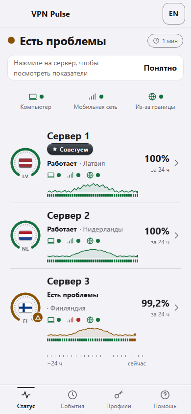
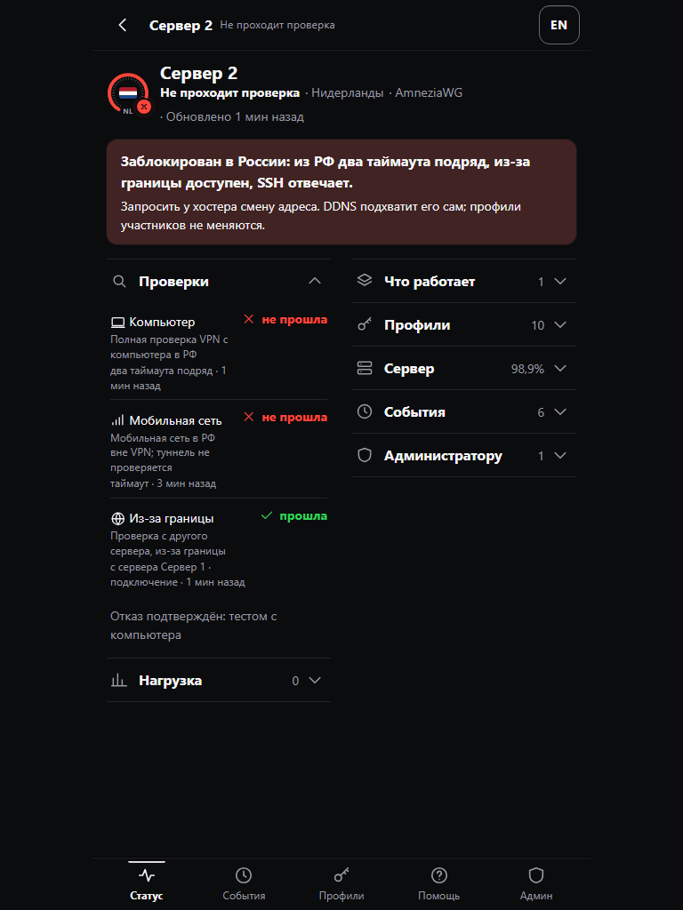

#  VPN Pulse

**Is my self-hosted VPN reachable right now — and which server should I pick?**

VPN Pulse is a Telegram Mini App and bot for people who run a few WireGuard / AmneziaWG
(and optionally Xray) servers for friends and family. It answers one question in three
seconds, backed by evidence rather than by the servers' own opinion:

- 💻 **Computer probe** — a real VPN handshake plus HTTPS through the tunnel, from inside the
  country where your users are.
- 📶 **Mobile probe** — DNS and reachability from a phone on the mobile network, outside the VPN.
- 🌍 **Cross-check from abroad** — your servers check each other, so "blocked in the country"
  and "the server is down" stop looking the same.

Zero connected users is **not** a failure. Missing data is shown as *no data*, never as a
green 100%. Members never see IPs, domains, ports or the hosting provider.

[Русская версия](README.ru.md)

## Status

| Part | State |
|---|---|
| Product & UX specification, design system, RU/EN content | complete |
| API contract (OpenAPI 3.1, JSON Schemas) | v1.4.1, validated in CI |
| Interactive UI prototypes (Mini App, Android probe, first run) | complete — [open them](docs/prototypes/README.md) |
| Backend core: config, SQLite migration, state evaluator, mock-first API, analytics ingestion | tests green (`pytest`) |
| Dev server: every API route on 13 demo scenarios, contract-validated (`python -m vpnpulse.dev`) | working |
| Mini App reads the API (`web/src`): same DOM from the API and from the scenarios, 337 screen comparisons | working |
| SQLite read model: every read route served from the database (`vpnpulse.storage.SqliteReadModel`), strict response models | working |
| SQLite writes: sessions, enrollment codes, probes, reports → observations, note, analytics, audit, retention sweep (`SqliteStore`); the API keeps no state between requests | working |
| Monitoring loop `vpn-pulse run`: collect → evaluate → snapshots → transitions → events → notification queue with retries; hourly sweep; `--demo` plays the scenarios over a real database | working |
| Administrator CLI: `vpn-pulse init / doctor / server add|list|remove / probe enroll|list|revoke / note set|clear|show`; `doctor` prints the Admin screen's next steps, exit code as a gate; secrets `0600`, never echoed | working |
| Installer: `./install.sh demo` (fictional data, no root, no Telegram), `sudo ./install.sh install` (system user, per-release venv, config + secrets, systemd units, Caddy snippet, doctor), `upgrade` with backup and auto-rollback, `rollback`, `uninstall` keeping data; checked end to end on a clean Ubuntu 24.04 (`scripts/install_check.sh`) | working |
| Gate A — the whole local chain in one test: scripted world → loop → SQLite → API → Mini App in a browser → Telegram Bot API on a fake transport (`tests/test_e2e_gate_a.py`); the Mini App sends its allowlisted analytics | green |
| Real servers: `vpn-pulse collector keygen | pin | test` + `deploy/helper/` — a `vpnpulse` user with one forced command, key-free aggregate output (handshake ages, counters, system facts), pinned host keys, `SshCollector` in the loop; `awg-host` and `awg-docker` | working (`hiddify` planned) |
| Telegram bot in a real group, PC / Android / cross-server probes | **planned** |

You can install it on a server today and watch fictional data move (`--demo-data`), or connect
your AmneziaWG servers through the read-only helper ([docs/connect-server.md](docs/connect-server.md));
the probes are the next increments. See [docs/quickstart.md](docs/quickstart.md).

## What it looks like

| Status screen (degraded) | Server details (dark) |
|---|---|
|  |  |

Every server is one row: a gauge ring with the flag shows the state (arc = 24-hour availability),
the row shows the three check sources and an availability chart. Tapping a row opens the server screen.

## Two commands to see it

```bash
git clone https://github.com/MarkSinD/VPN-Pulse.git && cd VPN-Pulse
./install.sh demo                                 # Mini App + API on fictional data at http://127.0.0.1:8765/app/mvp.html
sudo ./install.sh install --demo-data             # a real installation on Ubuntu 24.04 (systemd units, doctor); nothing real in it yet
```

## Five-minute developer preview

```bash
git clone https://github.com/MarkSinD/VPN-Pulse.git
cd VPN-Pulse
python -m venv .venv && . .venv/bin/activate    # Windows: .venv\Scripts\activate
pip install -e ".[dev]"
python -m pytest                                  # backend core + contract tests
python scripts/validate_specs.py                  # OpenAPI, schemas, RU/EN parity
python -m vpnpulse.dev                            # API on demo scenarios + the Mini App at /app/
vpn-pulse run --demo --db demo.sqlite3            # the monitoring loop on a scripted world (Ctrl+C to stop)
python -m vpnpulse.dev --sqlite demo.sqlite3      # …and the Mini App reading that database live
```

Then open <http://127.0.0.1:8765/app/mvp.html> (or `docs/prototypes/mvp.html` directly) and use
the showcase bar to switch scenarios (operational, degraded, unavailable, unknown, offline, clean
install, …), role, theme and language. The same scenarios are served by the API:
`GET /api/v1/status?scenario=unavailable&lang=en` after `POST /api/v1/dev/session?role=admin`.

## Documentation

- [Quick start](docs/quickstart.md) · [Быстрый старт](docs/quickstart.ru.md)
- [Concepts](docs/concepts.md) — states, freshness, sources, recommendation
- [Configuration](docs/configuration.md) · [Конфигурация](docs/configuration.ru.md)
- [Connect a server](docs/connect-server.md) · [PC probe](docs/probes/pc.md) · [Android probe](docs/probes/android.md)
- [User guide](docs/user-guide/status-and-recommendations.md) · [Admin actions](docs/user-guide/admin-actions.md)
- [Architecture](docs/architecture.md) · [API](docs/api.md) · [Privacy](docs/privacy.md) · [Compatibility](docs/compatibility.md)
- [Operations](docs/operations/doctor.md) · [Troubleshooting](docs/troubleshooting.md)
- [Contributing](CONTRIBUTING.md) · [Security policy](SECURITY.md) · [Changelog](CHANGELOG.md)

## Limitations

- Nothing here changes your VPN. Collectors are read-only by design; the app never issues keys.
- Blocking detection is inference from independent checks, not proof. The UI says
  *"connection check failed from the home network"*, and only the administrator sees the
  probable cause.
- One computer probe covers one network. Coverage of other carriers needs more probes.

## License

MIT — see [LICENSE](LICENSE).
